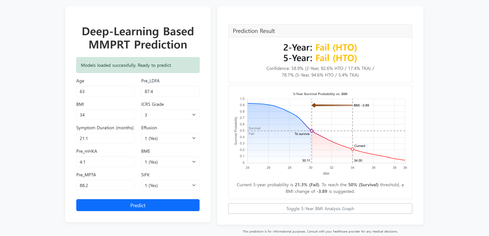

<h2 align="center">AI-Based Prediction of Prognosis Following Nonoperative Treatment for Medial Meniscus Posterior Root Tear</h2>
<!-- <p align="center">
  <a href="https://InhwanBae.github.io/"><strong>Inhwan Bae</strong></a>
  ·  
  <a href="#"><strong>Author 1</strong></a>
  ·
  <a href="#"><strong>Author 2</strong></a>
  <br>
  Journal Name, Year
</p> -->

<p align="center">
  <a href="https://inhwanbae.github.io/mmprt-prediction/"><strong><code>Web Application</code></strong></a>
  <a href="#"><strong><code>Publication</code></strong></a>
  <a href="https://github.com/InhwanBae/mmprt-prediction"><strong><code>Source Code</code></strong></a>
</p>

<div align='center'>
  <br>
  <br><em>Screenshot of the online MMPRT prediction service.</em>
</div>

<br>This repository provides the source code for training and testing machine learning and deep learning models to predict Medial Meniscus Posterior Root Tear (MMPRT) using patient demographic data and measurements.

<br>

## Model Inference
For a live demonstration, you can directly use the pre-trained deep-learning models on our [**Web Application**](https://inhwanbae.github.io/mmprt-prediction/)

<br>

## Training your own models
You can train and test your own models using the provided code. Follow the instructions below.
  - [**`Environment Setup`**](#environment-setup): Instructions to set up environment.
  - [**`Data Preparation and Model Training`**](#data-preparation-and-model-training): Instructions to evaluate models with your own data.

> [!NOTE]
> If you are using MacOS or Linux, please refer to the manual steps provided in the details sections. Click on *"Manual way (optional)"* to expand the instructions.

<br>

### Environment Setup

[Video_instruction_for_environment_setup.webm](https://github.com/user-attachments/assets/78af4f0b-acaa-4eda-9e9b-d5845857cc9b)

**1. Install Python 3.11**
  - In your browser, download the ["Python 3.11 Windows Installer"](https://www.python.org/ftp/python/3.11.9/python-3.11.9-amd64.exe) from the official website.

    <details>
      <summary><code>Manual way (optional)</code></summary>

    - If you are using MacOS, download the the ["Python 3.11 macOS Installer"](https://www.python.org/ftp/python/3.11.9/python-3.11.9-macos11.pkg) from the [official website](https://www.python.org/downloads/release/python-3119/).
    - If you are using Linux, you can install Python 3.11 using your package manager. For example, on Ubuntu, you can run:
      ```bash
      sudo apt update
      sudo apt install python3.11
      ```
    </details>

  - Run the installer. Crucially, check the box for "Add python.exe to PATH" and then choose "Install Now".

**2. Download the source code**
  - In your browser, download the source code from the official ["GitHub Repository"](https://github.com/InhwanBae/mmprt-prediction/archive/refs/heads/main.zip).

    <details>
      <summary><code>Manual way (optional)</code></summary>
    Alternatively, you can follow these steps:
    
    - In your browser, go to: https://github.com/InhwanBae/mmprt-prediction
    - Click the green "Code" button → "Download ZIP".
    </details>

  - Open File Explorer, right-click the downloaded ZIP → "Extract All...", choose a destination folder (e.g., `C:\Users\User\Documents`) and click "Extract".

**3. Create a virtual environment & install requirements**
  - In File Explorer, navigate to the extracted folder (e.g., `C:\Users\User\Documents\mmprt-prediction-main`).
  - To prepare the Python environment: Double-click `Setup_Environment.bat`.
  
    <details>
      <summary><code>Manual way (optional)</code></summary>
      
    Alternatively, you can manually set up the environment:<br>
    
    - Open Command Prompt in this folder by clicking the address bar of File Explorer, type `cmd`, and press Enter.
    - In the opened Command Prompt window, run the following commands one by one by one:
      ```cmd
      :: Create a virtual environment named .venv
      python -m venv .venv
      
      :: Activate the virtual environment
      .venv\Scripts\activate
      
      :: Install the required packages
      pip install -r utils/requirements.txt
      ```
    </details>

<br>

### Data Preparation and Model Training

[Video_instruction_for_data_preparation_and_model_training.webm](https://github.com/user-attachments/assets/5689c5d2-8887-4347-9d87-ba6e5d7e7974)

**4. Prepare your data**
  - Place your CSV data file(s) in the `data` folder. All CSV files in this folder will be automatically detected and gathered for training and testing the models. If you don't want to use certain files, simply remove them from this folder, or move to `not_used` folder.
  - Check the configuration files in the `config` folder to match your dataset's schema.
    - `config/input_output_cols.yaml`: Define the model's input and output columns.
    - `config/group_cols.yaml`: Specify column groupings used by the deep learning model.

**5. Run Model Training and Evaluation**
  - Once your environment is set up and data is prepared, you can run the training and evaluation scripts.
  - To train and test Machine Learning models: Double-click `Run_Machine_Learning.bat`.
  - To train and test Deep Learning models: Double-click `Run_Deep_Learning.bat`.
  
    <details>
      <summary><code>Manual way (optional)</code></summary>

    Alternatively, you can run the following command in Command Prompt:
    
    - Open Command Prompt in this folder by clicking the address bar of File Explorer, type `cmd`, and press Enter.
    - In the opened Command Prompt window, run the following commands one by one by one:
      ```cmd
      :: Activate the virtual environment
      .venv\Scripts\activate

      :: Run the training and testing scripts
      python train_test_ML_models.py
      python train_test_DL_models.py
      ```
    </details>

  - The trained models and evaluation results will be saved in the `results` folder. You can repeat this process (4 and 5) with different data or configuration settings.
